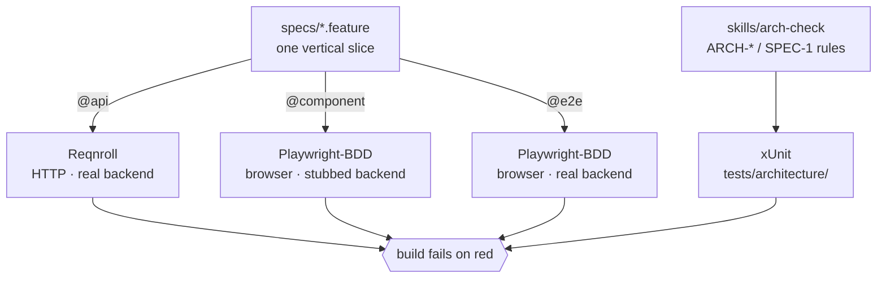
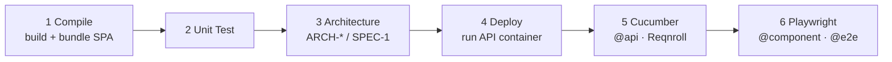

# Architecture

How SpecWarden enforces a spec against a .NET + Angular codebase. This is the
implementation behind the README's "Guards, not vibes."

## 1. The model: SSOT + runner-guarded

A **single source of truth (SSOT)** artifact is a document that is the *only* place a
fact lives. SpecWarden has two:

1. **Behaviour** — `specs/*.feature` (Gherkin). What the system must do.
2. **Structure** — the rules described in `skills/arch-check`. How the code must be shaped.

Each SSOT is **runner-guarded**: an executable reads it on every build and the build
fails when the code no longer matches it. Without a runner, a spec is just a wish that
rots. With one, the spec *is* the contract.

```
specs/*.feature ──► Gherkin runner ──► pass/fail   (behaviour)
arch-check rules ─► architecture runner ─► pass/fail (structure)
```

## 2. One slice = one feature file, routed by level tag

A feature file is **one vertical slice** — a single story, cutting through API, UI, and
persistence. Within it, each scenario carries exactly one **level tag** that decides
which runner owns it:



| Level tag    | Owning runner            | What it proves                                          | Backend |
| ------------ | ------------------------ | ------------------------------------------------------ | ------- |
| `@api`       | Reqnroll (`tests/acceptance/reqnroll`) | the REST contract, driven over HTTP      | real    |
| `@component` | Playwright-BDD (`tests/acceptance/playwright`) | UI behaviour / UX in a real browser | **stubbed** |
| `@e2e`       | Playwright-BDD (`tests/acceptance/playwright`) | a thin smoke that the whole system is wired up | real |

The split is deliberate: most UI behaviour is fast and deterministic when the backend
is stubbed (`@component`), the REST contract is pinned independently of any browser
(`@api`), and only a *few* `@e2e` scenarios pay the cost of standing up the real system.
Auxiliary tags compose on top: `@failure` marks an error-path scenario, `@nfr` marks a
non-functional one (excluded from the behaviour lanes today).

### Tag routing in practice

Nobody copies a requirement between runners by hand — each lane syncs the scenarios it
owns out of `specs/` at build time:

- **`scripts/stage-cucumber.sh`** copies every `.feature` containing `@api` into
  `tests/acceptance/reqnroll/Features/`, then runs `dotnet test --filter Category=api`.
  The whole file is copied but only `@api` scenarios run, so Reqnroll is never asked to
  bind browser-level steps it has no definitions for.
- **`tests/acceptance/playwright/sync-specs.mjs`** copies every `.feature` containing
  `@e2e` or `@component` into the Playwright `features/` folder; `bddgen` then codegens
  runnable specs into `.features-gen/` (gitignored). `playwright.config.ts` filters with
  `not @nfr and not @api`.

A file with none of these tags is ignored by both lanes. That is the lever the spec
lifecycle guard pulls — see §5.

## 3. The protocol-driver seam

Each level speaks its own vocabulary, and the runner binds that vocabulary to a **driver**
(the "protocol driver") so the scenario text stays declarative:

- **`@api` (Reqnroll)** — `StepDefinitions/*.cs` drive the **deployed service over HTTP**
  (`HttpClient`, base URL from `API_BASE_URL`). No mocking; this is the real REST contract.
- **`@component` / `@e2e` (Playwright)** — steps speak a DSL class in `dsl/`, never raw
  Playwright. The *same* steps run at both levels; the level tag flips one switch:
  `@component` answers the backend boundary locally with `page.route(...)`, while `@e2e`
  lets the calls hit the real backend and resets it to a known state first.

This is why one `.feature` can describe behaviour at three levels without three different
vocabularies leaking into the prose.

## 4. The structure guard (architecture-as-tests)

The architecture standards in `skills/arch-check` are not a doc a reviewer is trusted to
remember — they are executable. `tests/architecture/` is a plain xUnit project
where **each mechanically-checkable rule maps to a `[Fact]`**, so `dotnet test` (and CI)
breaks the build on a violation, exactly like a failing scenario:

- `StructuralStandards.cs` — ARCH-1 (every executable service ships a `Dockerfile`),
  ARCH-2 (backend targets `net10.0`), ARCH-3 (frontend is an Angular workspace).
- `SpecHygieneStandards.cs` — SPEC-1 (no spec is left a stub; see §5).
- ARCH-4 (clean-code discipline) has **no** `[Fact]` — it is judgment-only (single
  responsibility, no duplication, DI, no logic in controllers/components) and stays a
  manual concern enforced by `code-review`, not by this lane.
- `RepoRoot.cs` — locates the repo root by walking up to the directory containing
  `AGENTS.md`, so the rules inspect the real tree instead of hardcoded paths.

## 5. Dormant-until-present guards

A bare clone of SpecWarden is **green**, yet a half-finished slice is **red**. That balance
comes from two complementary behaviours:

- **Activate on presence.** ARCH-1/2/3 each return early (vacuously pass) until the matching
  directory exists — `src/backend`, `src/frontend`. You are never blocked for code you have
  not written. The moment the code appears, the rule becomes a build-breaker.
- **Fail on a stub.** A `brainstorm-task` stub carries an `@unspecified` scenario and a
  `# Status: Stub` header but **none** of the routing tags — so neither acceptance lane would
  ever run it, and it would pass silently. `SPEC-1` makes any such stub a build failure until
  `spec-task` replaces `@unspecified` with real, tagged scenarios. A stub cannot hide in CI.

## 6. The pipeline

`scripts/pipeline.sh` runs the lanes in order locally; `azure-pipelines.yml` runs the same
stages as blocking CI jobs. Each stage is a thin script in `scripts/` so local and CI share
one definition.




| # | Stage         | Script                  | Guard / purpose                                     |
| - | ------------- | ----------------------- | --------------------------------------------------- |
| 1 | Compile       | `stage-compile.sh`      | build backend solution + Angular; bundle the SPA into the API's `wwwroot` |
| 2 | Unit Test     | `stage-test.sh`         | `dotnet test` + `ng test`                            |
| 3 | Architecture  | `stage-arch.sh`         | the structure guard (ARCH-* / SPEC-1)               |
| 4 | Deploy        | `stage-deploy.sh`       | build + run the API container (Podman, falling back to Docker) so acceptance has a live target |
| 5 | Cucumber      | `stage-cucumber.sh`     | `@api` behaviour guard (Reqnroll over HTTP)         |
| 6 | Playwright    | `stage-playwright.sh`   | `@e2e` + `@component` behaviour guard               |
| - | Cleanup       | `stage-cleanup.sh`      | tear down containers (opt-in)                        |

Stages auto-skip when there is nothing to do: `pipeline.sh` runs Compile/UnitTest only when
a backend solution or `src/frontend` exists, and `stage-deploy.sh` skips when no `Dockerfile`
is found under `src/`. The container choice is recorded in
[adr/ADR-001-container-runtime.md](adr/ADR-001-container-runtime.md).

## 7. Single deployable unit

The Angular build is bundled into the API at compile time (`stage-compile.sh` copies
`src/frontend/dist/.../browser` into the API's `wwwroot/`), and `Program.cs` serves it via
`UseStaticFiles` + `MapFallbackToFile("index.html")`. So the frontend and backend ship as
**one container on one port** (8080). That is why the acceptance lanes default to a single
origin (`http://localhost:8080`) rather than a separate `ng serve` on 4200, and why
`@component` route-stubbing and `@e2e` live calls hit the same relative `/api/board` URL.
The rationale for shipping as one unit is recorded in
[adr/ADR-002-single-deployable-unit.md](adr/ADR-002-single-deployable-unit.md).

## Where to look in the code

| Concept                     | File(s)                                                            |
| --------------------------- | ----------------------------------------------------------------- |
| Spec SSOT                   | `specs/*.feature`                                                  |
| `@api` routing + run        | `scripts/stage-cucumber.sh`                                       |
| `@component`/`@e2e` routing | `tests/acceptance/playwright/sync-specs.mjs`, `playwright.config.ts` |
| `@api` protocol driver      | `tests/acceptance/reqnroll/StepDefinitions/*.cs`                  |
| browser protocol driver     | `tests/acceptance/playwright/dsl/fixtures.ts`                     |
| structure guard             | `tests/architecture/*.cs`                                         |
| pipeline                    | `scripts/pipeline.sh`, `azure-pipelines.yml`                      |
